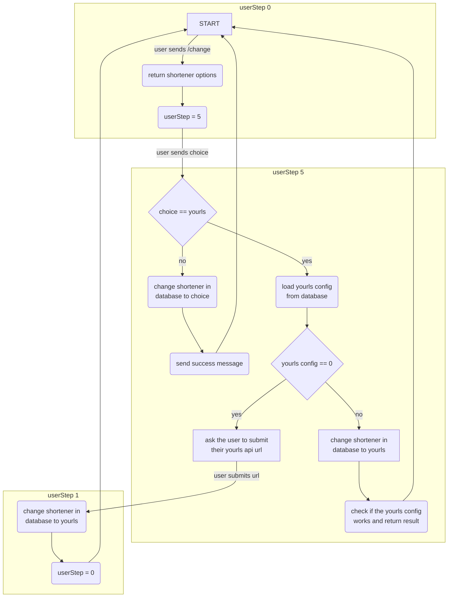

# LetsShortBot

The Let's Short URL Bot is a simple [Telegram bot](https://t.me/LetsShortBot) to short your URLs.

You can choose between different providers like Tinyurl, Cuttly, IS.GD, V.GD, but you can also configure your own [YOURLS](https://github.com/YOURLS/YOURLS) URL shortener.
When you're finished with the settings you can just send your long links and get back the shortened version.

## YOURLS Setup

If you want to use the bot with your own YOURLS shortener I have some tips for you.
Requirements for your own URL shortener with YOURLS are your own web server, a MySQL or MariaDB database and a (as short as possible) domain.

- Download the [latest version of YOURLS on GitHub](https://github.com/YOURLS/YOURLS/releases) and unzip the data. 
- Copy the file user/config-sample.php to user/config.php and insert your database settings. 
- Further parameters to set can be found [here](https://yourls.org/#Config). 
- Upload the files to your webserver. 
- Go to _your-domain.com/admin_ and log in. 
- Activate the plugin "RandomShortURLs" under "Plugins" and set the URL length. 
- Go to "Tools" and copy your API link in format https://your-domain.com/yourls-api.php?signature=<value>
- Go back to the bot, send _/change_ and click on "YOURLS" at the keyboard and in the next step paste your copied link.

## Documentation

### Dependencies
#### Python packages
- [Flask](https://pypi.org/project/Flask/) 2.2.2
- [requests](https://pypi.org/project/requests/) 2.28.1
- [pyTelegramBotAPI](https://pypi.org/project/pyTelegramBotAPI/) 4.7.0
- [python-firebase](https://pypi.org/project/python-firebase/) 1.2
- [firebase-admin](https://pypi.org/project/firebase-admin/) 5.3.0
- [urllib3](https://pypi.org/project/urllib3/) 1.26.12
- [beautifulsoup4](https://pypi.org/project/beautifulsoup4/) 4.11.1
- [certifi](https://pypi.org/project/certifi/) 2022.6.15
- [configparser](https://pypi.org/project/configparser/) 5.3.0

### Database structure
```
.
├── user
│   ├── <id>
│   │   ├── first_name: <value>
│   │   ├── lang: <value>
│   │   ├── last_name: <value>
│   │   ├── provider: <value>
│   │   ├── url_count: <value>
│   │   ├── urls
│   │   │   ├── 0
│   │   │   │   ├── url: value
│   │   │   ├── 1
│   │   │   │   ├── url: value
│   │   │   ├── ...
│   │   ├── username: <value>
│   │   ├── yourls: <value>
│   ├── ...
└──
```

### Running the code

To run the code locally you need the following:

- [JSON credentials](https://firebase.google.com/docs/admin/setup#python) and project url of Firebase project with Realtime database
- [Telegram Bot token](https://t.me/botfather)
- A Python (minimum 3.8) environment with the dependencies installed

Copy the firebase credentials JSON-file to your local version of the LetsShortBot to __firebase.json__.

Create a file called __letsshortbot.ini__ and paste your bot token and Firebase project url:

```buildoutcfg
[SETTINGS]
token = <YOUR_TOKEN>
database_url = https://<YOUR_PROJECTNAME>.firebaseio.com
```

You also need to add the api urls in the following format into the __letsshortbot.ini__ file.

```buildoutcfg
[PROVIDERS]
tinyurl = https://tinyurl.com/api-create.php?url=
isgd = https://is.gd/create.php?format=json&url=
vgd = https://v.gd/create.php?format=json&url=
cuttly = https://cutt.ly/api/api.php?key=<yourcustomkey>
```

### Functions
#### get_user_step
This function is needed to get the current step of one specific user.

The default step is 0 but it can be changed to enable functions that require the user to enter data several times in a row.

#### listener
Outputs the input of the users into the console.

#### command_start
Sends a welcome message and a message with all available commands.

Then the user is asked for the desired language setting and it'll be saved to the database.

#### command_help
Returns a message with all available commands and some information about it.

#### change_shortener
Provides the ability to change the url shortener within multiple steps.




## Contributing

Feature suggestion? Bug to report?

Please take a moment to review this document in order to make the contribution
process easy and effective for everyone involved.

Submitting an issue that is improperly or incompletely written is a waste of time for everybody.

Following these guidelines helps to communicate that you respect the time of
the developers managing and developing this open source project. In return,
they should reciprocate that respect in addressing your issue or assessing
### Using the issue tracker

The issue tracker is the preferred channel for [bug reports](#bug-reports),
[feature requests](#feature-requests) and [submitting pull
requests](#pull-requests), but please respect the following restrictions:

* Please **do not** use the issue tracker for personal support requests.  
  Use [discussions](https://github.com/simon-eller/LetsShortBot/discussions) instead to ask the community for help.

* Please **do not** derail or troll issues.  
  Keep the discussion on topic and respect the opinions of others.

### Bug reports

A bug is a _demonstrable problem_ that is caused by the code in the repository.
Good bug reports are extremely helpful - thank you!

Guidelines for bug reports:

1. **Use the GitHub issue search**  
   Check if the issue has already been reported. Reporting duplicates is a waste of
   time for everyone. Search in **all issues**, open and closed.
2. **Check if the issue has been fixed**  
   Try to reproduce it using the latest `master` or development branch in the repository.
   Maybe it has been fixed since the last stable release.
3. **Give details**  
   A good bug report shouldn't leave others needing to chase you up for more
   information. Please try to be as detailed as possible in your report.
   Give any information that is relevant to the bug: 
   * YOURLS & MySQL & PHP versions
   * Server Software
   * Browser name & version
   
   What is the expected output? What do you see instead? See the report example below.  
4. **Isolate the problem**  
   Isolate the problem as much as you can, reduce to the bare minimum required to reproduce the issue.
   Don't describe a general situation that doesn't work as expected and just count on us to pin
   point the problem. 

### Feature requests

Feature requests are welcome. But take a moment to find out whether your idea fits with the scope and aims of the project. It's up to you to make a strong case to convince the YOURLS developers of the merits of this feature. Please provide as much detail and context as possible.

### Pull requests

Good pull requests - patches, improvements, new features - are a fantastic
help. They should remain focused in scope and avoid containing unrelated
commits.

1. **Please ask first**  
   Before embarking on any significant pull request (e.g. implementing features,
   refactoring code), otherwise you risk spending a lot of time working on
   something that the developers might not want to merge into the project.
2. **Licensing**  
   By submitting a patch, you agree that your code will be licensed under the
   [Creative Commons Attribution Share Alike 4.0 International License](https://github.com/simon-eller/LetsShortBot/blob/main/LICENSE) terms.
3. **Coding Standards**  
   Please adhere to the coding conventions used throughout the project (indentation,
   comments, etc.). Make sure you've tested your patch under
   different scenarios (various browsers, non default installation path, etc.).

Adhering to the following this process is the best way to get your work
merged:

1. [Fork the repo](https://docs.github.com/en/github/getting-started-with-github/fork-a-repo), clone your fork,
   and configure the remotes.

   ```bash
   # Clone your fork of the repo into the current directory
   git clone https://github.com/<your-username>/<repo-name>
   # Navigate to the newly cloned directory
   cd <repo-name>
   # Assign the original repo to a remote called "upstream"
   git remote add upstream https://github.com/<upsteam-owner>/<repo-name>
   ```

2. If you cloned a while ago, get the latest changes from upstream.

   ```bash
   git checkout <dev-branch>
   git pull upstream <dev-branch>
   ```

3. Create a new topic branch (off the main project development branch) to
   contain your feature, change, or fix.

   ```bash
   git checkout -b <topic-branch-name>
   ```

4. Commit your changes in logical chunks. Please adhere to these [git commit
   message guidelines](https://tbaggery.com/2008/04/19/a-note-about-git-commit-messages.html)
   or your code is unlikely be merged into the main project. Use Git's
   [interactive rebase](https://docs.github.com/en/github/using-git/about-git-rebase)
   feature to tidy up your commits before making them public.

5. Locally merge (or rebase) the upstream development branch into your topic branch:

   ```bash
   git pull [--rebase] upstream <dev-branch>
   ```

6. Push your topic branch up to your fork:

   ```bash
   git push origin <topic-branch-name>
   ```

7. [Open a Pull Request](https://docs.github.com/en/github/collaborating-with-issues-and-pull-requests/about-pull-requests)
   with a clear title and description.

## Donating

If you like the project and want to help to keep it alive, please consider making a small donation.

<a href="https://www.buymeacoffee.com/simoneller" target="_blank"></a>